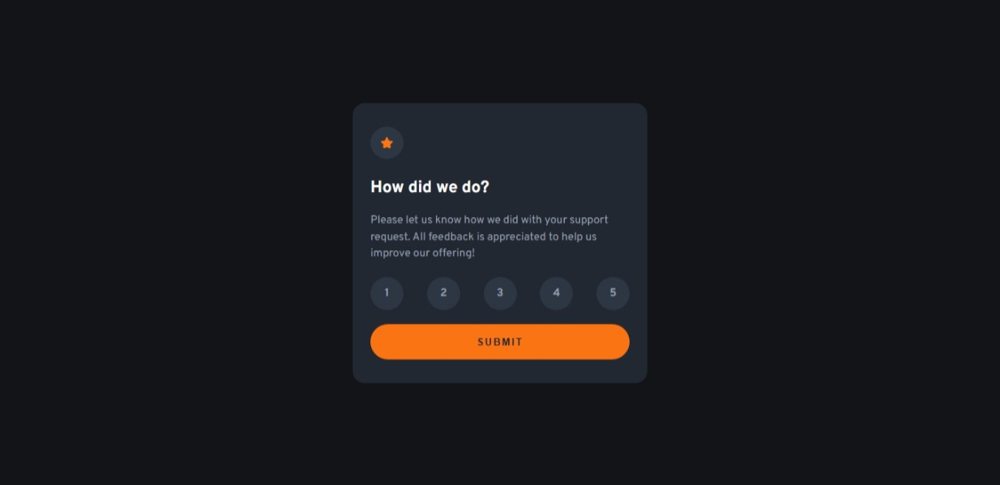

# Frontend Mentor - Interactive rating component solution

This is a solution to the [Interactive rating component challenge on Frontend Mentor](https://www.frontendmentor.io/challenges/interactive-rating-component-koxpeBUmI). Frontend Mentor challenges help you improve your coding skills by building realistic projects.

## Table of contents

- [Overview](#overview)
  - [The challenge](#the-challenge)
  - [Screenshot](#screenshot)
  - [Links](#links)
- [My process](#my-process)
  - [Built with](#built-with)
  - [What I learned](#what-i-learned)
  - [Continued development](#continued-development)
- [Author](#author)

## Overview

### The challenge

Users should be able to:

- View the optimal layout for the app depending on their device's screen size
- See hover states for all interactive elements on the page
- Select and submit a number rating
- See the "Thank you" card state after submitting a rating

### Screenshot

### Links

- Solution URL: [GitHub Repository](https://github.com/Innocent-Leo/Interactive-rating-component.git)
- Live Site URL: [Live Demo](https://interactive-rating-component-d084d1.netlify.app/)

## My process

### Built with

- Semantic HTML5 markup
- CSS custom properties
- Flexbox
- Mobile-first workflow
- Vanilla JavaScript

### What I learned

This project gave me hands-on experience with:

- Managing **active states** for rating buttons
- Using `addEventListener` for click and
- Updating the DOM dynamically with JavaScript (`textContent`, `classList`)
- Toggling components (rating screen → thank you screen)
- Handling edge cases (e.g., no rating selected on submit)

### Continued development

For future improvements, I’d like to:

- Add keyboard navigation for better accessibility
- Smooth animations when switching screens

## Author

- Frontend Mentor - [@Innocent-Leo](https://www.frontendmentor.io/profile/Innocent-Leo)
- LinkedIn - [@Innocent-Okeke](https://www.linkedin.com/in/innocentokeke)
- Twitter - [@itz_saintleo](https://www.twitter.com/itz_saintleo)
